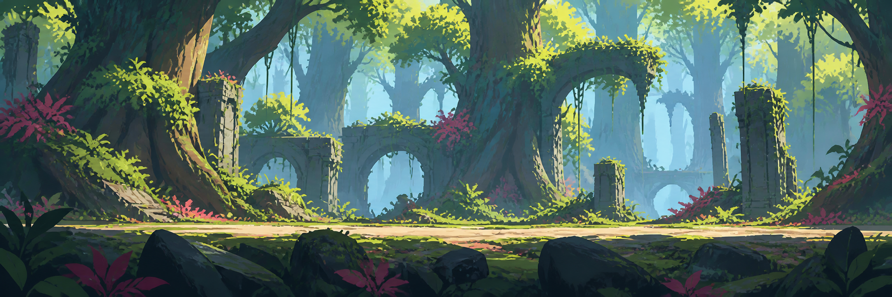
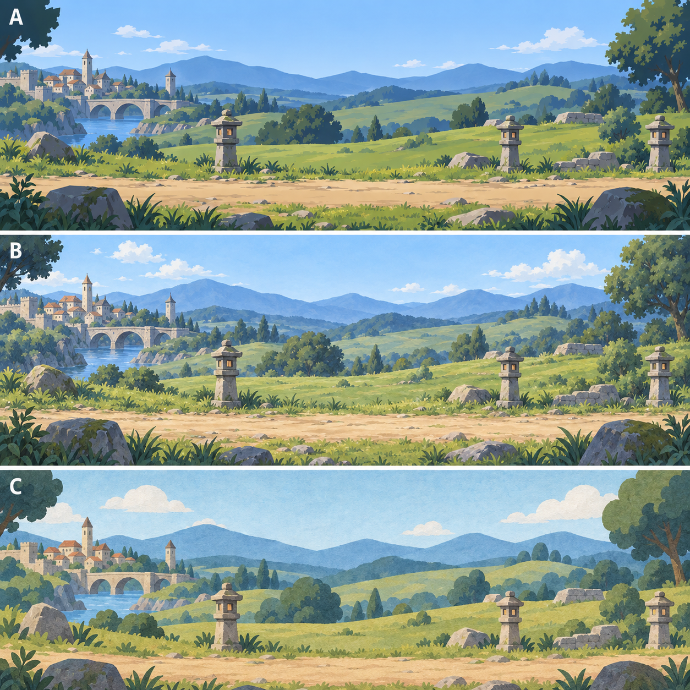

# 背景アートディレクションと制作引き継ぎ

更新: 2026-09-14。現在の段階: **v2の画風でC-1「霧の森」の3層を制作・Unityへ接続済み。時間・天候12条件とループ境界検査、既存102テストを確認済み**。

今回の制作判断: 左右に自然な空白を持つ森・遺跡・草石のモジュールを各層で繰り返し、地面の連続面はUnity側で描く。これにより違う幹や石を端で混ぜず、地面高さを一定に保つ。元PNGと実描画の両方で確認する。生成プロンプトは `art/backgrounds/2026-09-14/c1-layers/prompts.md` と `matte-prompts.md`。

### 実装と確認の記録

- 3枚の2172×724画像を `Assets/Resources/Art/Adventure/Modules/C-1/` に配置し、C-1のJSONから個別参照。元画像・生成記録は `docs/art/backgrounds/2026-09-14/c1-layers/`。
- 画像生成へ実アルファを2回指定したがRGBで返ったため、チェック柄版は不採用。採用素材は黒マットRGBであり、**透過PNGではない**。シェーダーが黒を除去し、左右2%をガードする。色空間がLinearでもGammaでも同じ黒判定になるよう処理。
- ソースの読み取り検査で、3枚とも左右端の復元アルファは0。空白の割合は遠44.4%／中51.9%／近80.7%。これは実描画の見た目やシームレス合格を意味しない。
- Cloudyをenum末尾へ追加。雨と独立して空・天体・地形の明るさを変更。屋内はClearへ変換。雲天時の夜が昼の灰色へ明るくならないよう乗算で調整。
- 隔離検証スクリプト `tools/environment-qa/run.ps1` とソース検査 `inspect_sources.py` を追加。Unityの初回起動はライセンス接続制限、次は一時manifestのBOMで失敗。BOMは修正済み。その後の再実行は自動承認レビューの利用上限で拒否されたが、本人の「続きをお願い」後に再開。
- 隔離Unityで4時間×3天候、3層それぞれ正逆3回の周期境界、全30地点の読み込み、実GameControllerの1280×720／2556×1179画面を確認。C-1の境界前後の最大平均RGB差は0.0002013812（0〜1）。画像も目視確認。
- 初回実描画で黒い縁と平らな地面が目立ったため、黒マットの境界だけ近傍色で補正し、地面を連続した色面の模様に変更。再検証も成功。
- EditMode 102件成功／失敗0／スキップ0。`docs/check_layout.py` も重なり・はみ出しなし。背景変更ではCoreや確率を変更していない。旧手順の独立100万Gハーネスは今回実行していない。
- [確認ページと再実行方法](../tools/environment-qa/README.md)、[実描画の検証結果](../tools/environment-qa/captures/validation.json)、[ループ境界の検証結果](../tools/environment-qa/captures/forest-validation.json)。HTMLは12条件と48コマの移動位置を切替可能。ブラウザでも切替・再生・停止を確認。
- QAはBuilt-inカメラによるuGUIと専用シェーダーの実描画。**本体のURP Play Mode、端末実機、GPU負荷、配布ビルドは未検証**。旧29地点の新画風化もこれから。


### Unityでの操作

Play中の `CharacterArea` → `ParallaxBackground` のInspectorでC-1を選び、Morning / Day / Evening / NightとCloudy等を切り替える。既存ステージ遷移からC-1へ入った場合も自動で新背景になる。外側の背景は主背景へ同期する。

```csharp
background.SetStage("C-1");
background.SetTimeOfDay(AdventureTime.Evening, 2);
background.SetWeather(AdventureWeather.Cloudy, .8f, 2);
background.SetWeather(AdventureWeather.Rain, .7f, 2);
```

新しい `layers` 設定を持つ地点だけ個別PNG方式を使う。各層のtexture／speed／phase／height／bottomと地面色は `adventure_environments.json` で調整する。黒マットPNGはこの専用シェーダーで使う素材であり、通常のSpriteに置くだけでは透過しない。

ユーザー回答: 「少しテイストが違うので参考画像をお渡しします。」続いて参考画像3枚と「こんな感じです」を受領。その後v2へ「近づいているので進めてください」と回答。**ユーザーの参考画像とv2の方向で制作を継続することは承認済み**。Bを含め初回案を基準として量産しない。

## 最新の画風見本v2



- 題材: C-1「霧の森」。2172×724、3:1。組み込み `image_gen` で参考画像3枚を入力して生成。
- 画風: **大きな色面、角のある筆致、深い有彩色の影、鮮やかな光、遠景の明度差による奥行き**。淡い牧歌的な絵より、幻想的な背景美術を目指す。
- 目視確認: 巨木・遺跡の大きなシルエット、青緑の遠景、黄緑の明部、赤紫の小さな差し色。画面下部にほぼ水平な歩行帯が連続している。
- 参考3の森林を主とし、参考1の色対比と参考2の岩の面表現を加えた。参考にある縦長の階段や奥へ進む道は、横スクロール向けの道に組み替えた。
- 限界: 見本には明部と霞を合成して描いている。**シームレス保証・透過層・時間／天候差分・Unity実描画は未作成／未検証**。左右端の幹・石・明度も本番時の調整対象。
- 生成プロンプト全文: [forest-reference-v2.prompt.md](art/backgrounds/2026-09-14/forest-reference-v2.prompt.md)。初回A/B/Cは下記に履歴として保存。

### 参考画像の保存場所と読み取り

ユーザー提供画像を一時フォルダからプロジェクト内へコピーして保持。生成見本とは分け、ユーザー提供の参照資料と明記する。出典・権利情報は今回提供されていないため、配布用ゲーム素材や記事の公開画像としては扱わない。

| 画像 | 保存先 | 制作上の読み取り |
|---|---|---|
| 参考1：紫の森と石段 | [reference-01-violet-ruins.png](art/backgrounds/2026-09-14/reference-01-violet-ruins.png) | 紫・群青の影、シアンの奥、桃色のアクセント。段差と岩は大きな面で描く |
| 参考2：青い洞窟と水辺 | [reference-02-blue-cavern.png](art/backgrounds/2026-09-14/reference-02-blue-cavern.png) | 角のある岩の輪郭、硬い筆の跡、限定した青系パレット、少数の明るい面 |
| 参考3：緑の森と巨大遺跡 | [reference-03-green-forest.png](art/backgrounds/2026-09-14/reference-03-green-forest.png) | 巨大な幹とアーチ、暗い前景、黄緑の樹冠、青緑の奥行き。葉は大きなまとまり |

共通の制作ルール案: 全周の黒い輪郭線を付けない。形の境界を色面と明度差で出す。岩・樹皮を写実的な微細模様で埋めず、筆跡と平面で表現する。鮮やかさは全画面一様に上げず、広い寒色の影に明部と少数の差し色を置く。

ステージごとの配色案: 森は参考3、神秘的な遺跡は参考1、洞窟・水路は参考2を手掛かりにする。ただし紫の森を夕方専用、青い洞窟を夜専用とは決めない。土地固有の基本色と時間帯の色は別に管理する。

## 1. 今回のユーザー要件（確定）

- 背景制作の続きを行う。まずテイストを決める。
- 現状よりアニメチックにする。
- 横スクロール中もつなぎ目が見えない構成にする。
- Unityで朝・昼・夕方・夜、雨・曇りなどステージ状態に応じて見栄えを変える。
- 他のセッション・セクションでも継続できるよう、常にMDへ記録する。

## 2. 現状確認（今回ソースと素材を確認）

| 対象 | 確認した現状 | 次の制作に関わること |
|---|---|---|
| Unity | `6000.3.15f1` | 既存環境を維持する |
| ステージ | `adventure_environments.json` と背景PNGは30地点 | 画風選定後、代表地点で試作してから展開 |
| イラスト | 1地点のPNGに遠景・中景・近景の3行 | `farEnd` / `middleEnd` は素材ごとに異なる |
| 描画 | `ParallaxBackground` のuGUI `RawImage` と専用シェーダー | 新背景も既存のUIマスク・描画順と整合させる |
| スクロール | 遠・中・近で異なる速度、歩行中に進行 | 各層が独立してループできる必要がある |
| 継ぎ目 | `AdventureSeamless.shader` が左右16%をアルファ考慮で重ねる | 周期の飛びを抑えるが、異なる地形・建物の二重像は素材側の連続性で防ぐ |
| 時間 | Morning / Day / Evening / Night、時刻補間、既定720秒周期 | 制御の入口は既存APIを利用可能 |
| 天候 | Clear / Rain / Storm / Snow / Fog / Embers / Drips / Spores | **Cloudyは未実装**。今の曇天色は雨・雷雨に従属 |
| 屋内 | 雨・雷雨・雪をDripsへ変換 | 屋外の空・天候を洞窟へそのまま適用しない |
| 色と光 | 時間の色をイラストへ乗算。局所光は別の描画 | 元絵の強い日差しや灯の明るさは、色を掛けるだけでは消せない |

主なコードは `UnityProject/BigBonusBlitz/Assets/Scripts/BBB.Runtime/` の `ParallaxBackground.cs`、`AdventureEnvironmentCatalog.cs`、`AdventureAtmosphereGraphic.cs`。

`A-1.png` を目視確認。草・花・石の細密な描写が多く、今回の簡略化対象にする。既存の `tools/adventure-ui-qa/adventure-v2-1280.png` は旧背景の記録で、現在の背景をUnityで再撮影した証拠には扱わない。

開始時から30枚のAdventure PNGの `.meta` に未コミット変更あり。今回の画風検討では編集していない。

## 3. テイスト比較



同じ草原・街・灯の道、ほぼ同じ構図で描写方法を比較する。細部まで完全に同じ形状ではない。前例欄は表現形式の説明で、特定作品の模倣指定ではない。

| 案 | 見た目と表現形式の前例 | 死に筋（避ける方向） | 制作の障壁 | 決め手 |
|---|---|---|---|---|
| A：セル画調 | アニメの背景に見られる面の整理。明瞭な輪郭、2〜3段階の陰影、少ない質感 | 黒い太線を全物体に付けるとキャラより背景が目立つ | 30地点の線の太さ・影の段階を揃える必要 | 輪郭の明快さとキャラの読みやすさ |
| B：柔らかな手描きアニメ調（推奨・未採用） | 手描き背景美術の広い色面と控えめな筆致。部分的な色線 | 草の一本描き・岩の細密模様を増やすと現在の写実寄りへ戻る | 手描きの温かさと細部の少なさを維持する必要 | 冒険の情緒を残してアニメ寄りにできる |
| C：絵本調 | 絵本・切り絵的な平面の重なり。丸い形、紙の質感 | 幼くしすぎると竜の巣・廃坑の緊張感が弱まる | 暗いステージにも同じ単純化を展開する必要 | デフォルメの強さと独自のまとまり |

初回の提案ではBを推奨したが、ユーザーからテイストが違うとの回答があったため未採用。上表は検討履歴として保持し、次の案は参考画像を基準にする。

### 比較画像の扱い

- 組み込み `image_gen` で生成したコンセプト1枚。Unityへは取り込んでいない。
- [生成プロンプト全文](art/backgrounds/2026-09-14/style-board.prompt.md)。画像は同フォルダの `style-board-v1.png`。
- A/B/Cの画風差と横長の歩行帯を目視確認。
- 雲・灯の暖色・左右端の大木が絵に含まれる。**本番では雲と発光を分離し、端の大木も周期を設計し直す**。
- この画像自体はシームレスな本番タイルではなく、透過レイヤーのアトラスでもない。切り取って既存30地点へ置換しない。

## 4. 初期のレイヤー構成案（履歴。現行実装は冒頭を参照）

| 奥からの順番 | 内容 | 時間・天候との関係 | ループ方針 |
|---|---|---|---|
| 1 | 空の色・太陽・月・星 | Unityで制御 | 空のグラデーションは固定、天体は独立 |
| 2 | 雲 | 雲量・暗さ・風速を制御 | 背景とは別周期 |
| 3 | 遠景の山・遠い街 | 遠景色・霞の量を調整 | 遠景自身が左右連続 |
| 4 | 中景の丘・森・遺跡 | 基本色＋時間色 | 中景自身が左右連続 |
| 5 | 地面・近景の草・石 | 暗さ・濡れの補助マスク | 足元の高さも左右連続 |
| 6 | 既存キャラクター | 背景とは独立 | 前景で顔と行動を隠さない |
| 7 | 灯の発光・薄い霧・雨等 | 個別の強度と色、環境条件 | 発光は灯本体の位置・スクロールに追従 |

当初は遠・中・近を別のRGBA PNGで保持する案だった。実際の生成がRGBだったため、C-1は2172×724の黒マット3枚をシェーダーで透過する方式に変更済み。チェック柄版は採用しない。

現行互換アトラスへまとめる場合は、別PNGを正本とし、変換時に行境界と余白を出力する。現行の最大2048取り込み設定・3層の高さ配置では、そのまま縦結合すると解像度と比率が変わるため、取り込み方式をA-1試作時に決める。

絵には中立の基本色と弱い接地影だけを残す。強い夕焼け、長い日向の影、太陽、星、雨筋、厚い霧、窓や灯の発光は焼き込まない。夜は全面を黒くするだけでなく、地形の明度差と青系の環境色を残し、発光だけを独立して上げる。

## 5. シームレス制作の契約

1. 各層単独で、左端と右端の地形の高さ・色・アルファ・輪郭の流れを連続させる。大きな門や建物を接合位置にまたがらせない。
2. 横方向50%の循環シフトで元の左右端を中央に出し、中央の接合を修正する。修正後も新しい左右端を確認する。
3. 左右反転の繰り返しで済ませない。城や崖が鏡合わせになる構成を避ける。
4. 本番タイルは3回以上横に並べて目視確認。端画素だけ合っていても、地形の折れ・明るい帯・同じ樹木の目立つ周期があれば不合格。
5. 画像が連続したら、専用シェーダーに重ね合わせなしのタイル描画経路を設ける。**現行の `_Overlap` に単純に0を渡すだけでは対応完了にしない**。今の式とRangeは0用ではないので分岐を実装・検証する。
6. マスク、Bilinear補間、圧縮後、サブピクセル移動でも透過端の黒い線・アトラスの隣行が出ないことをUnityで確認する。
7. 草原から森へのステージ切替は、同一タイルのループとは別の課題。既存クロスフェードを基本とし、地面基準と画面占有率を合わせて不自然な段差を抑える。

## 6. 時間・天候・ステージ状態の構成案

既存の時刻制御を維持し、見た目の状態を「ステージの地形」「時刻」「雲量」「降水の種類と強度」「霧」「風」「濡れ」「局所光」に分ける。晴れ／曇り／雨はこの組み合わせのプリセットとし、値は環境用データで管理する。

| 状態 | 空・地形 | 別描画 |
|---|---|---|
| 朝 | 淡い暖色の地平線、控えめな青い影 | 任意の朝霧 |
| 昼 | 基本色が読める青空と明度 | ステージ指定の雲量 |
| 夕方 | 桃色〜橙の空と紫寄りの影 | 灯の点灯 |
| 夜 | 深い青、輪郭を読める明度差 | 月・星・灯の発光 |
| 曇り | 雲量を増やし、彩度と陰影差を抑える | 降雨は0、日月と星を雲量で隠す |
| 雨 | 曇天＋必要な範囲の地面の濡れ | 雨筋、少量の水はね |
| 雷雨 | 厚い雲と暗い環境色 | 雨、既存の雷表現 |
| 霧 | 層の距離に応じて遠景のコントラストを下げる | 低速で動く霧 |

雪・胞子・火の粉・水滴の既存設定も維持する。屋内は屋外の時刻に追従する部分を抑え、入口の光や局所光で変化させる。

独立したCloudyはenum末尾への追加で実装済み。既存のenum値と粒子seedを維持し、雨なしで曇天になる状態を確認した。雲量・濡れ等の独立した連続パラメーターへの分離は今後の拡張。ゲームの確率・報酬を背景用の乱数や状態で変更しない。

`SetHour` / `SetTimeOfDay` / `SetWeather` / `SetStage` は既存API。雲量・濡れ等は**提案中で、呼び出せるAPIはまだない**。ステージ切替では現在 `SetStage` が基本天候を設定するため、イベント等の上書きが必要な場合は「イベント指定＞ステージ指定＞共通既定」の優先度を実装時に定義する。

## 7. 次の作業と完了条件

1. 完了: v2の方向で進行承認、C-1の3層制作、個別PNG接続、Cloudy追加、12条件・周期境界・ゲーム画面の確認。
2. 次の制作: A-1「草原の入口」で開けた空と街の遠景へ展開。C-1の巨木をそのまま他の地形へ流用しない。
3. 次の代表地点: E-2「結晶の間」、H-1「竜の巣」で暗所・発光を制作。灯や結晶の発光は非発光本体と別素材にする。
4. 代表地点の基準を揃えた後、残りの旧29地点を順に新画風へ変更する。各地点で黒マットの色域・左右端・地面高さ・12条件を確認する。
5. 実行環境の追加確認: 本体のURP Play Mode、歩行と停止の実速度、端末実機のGPU負荷、長時間の遷移を確認。今回の移動確認は位置指定による実描画であり、端末の動作性能測定ではない。

今回の確認範囲と未実施事項は冒頭の「実装と確認の記録」に集約。初回案と見本の段階で未実施だった事項を、現行実装の未実施事項と混同しない。

## 8. 更新の作法

このMDは背景の正本。状態が変わるたび「現状」「採用決定」「成果物」「検証」「次の作業」を更新する。生成プロンプトと比較画像は日付フォルダに残す。過去の案を削除せず、新版と採用履歴を追記する。別セクションでも同じ項目でMDを用意し、`PROJECT_STATE.md`から到達できるようにする。
