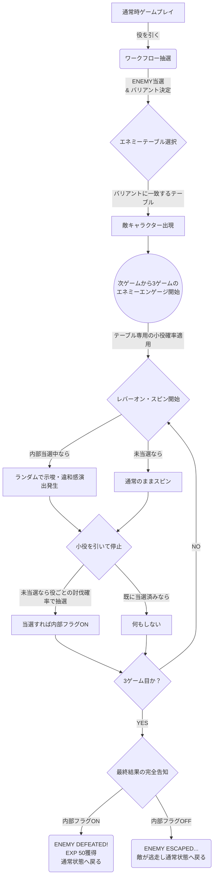

# 👾 エネミーエンゲージシステム 仕様書

本ドキュメントは、「BigBonusBlitz」におけるエネミーエンゲージ（敵とのバトル要素）の仕様と全体のフロー、およびエディターでの設定方法をわかりやすくまとめた資料です。

---

## 1. 全体フロー（発生から決着まで）

エネミーエンゲージは、以下の **「4つのフェーズ」** で進行します。

### フェーズ①：エンゲージ発生（通常時）
1. プレイヤーがスロットを回し、役（ベル、チェリーなど）を引きます。
2. 役に応じて **「ワークフロー抽選」** が行われ、`ENEMY` カテゴリに当選するかどうかが決まります。
3. 当選と同時に、内部で **「バリアント（A〜F）」** が決定されます。

### フェーズ②：敵の出現（テーブル決定）
1. フェーズ①で決定したバリアント（例：Variant B）をもとに、専用のエネミーテーブルが検索されます。
2. 一致するテーブルがあれば、そのテーブルの「敵キャラクター」が画面右からスライドインして登場します。

### フェーズ③：エンゲージ状態（Tier2：3G間）
1. 敵が登場した **次のゲーム** から、3ゲーム間の特別なチャンス状態（Tier2）に突入します。
2. この3ゲーム間は、通常時ではなく **「その敵テーブル専用の小役確率」** に完全に切り替わります（ハズレが減るなど）。
3. スピン開始時、もし内部的に討伐が確定している場合は、一定確率で **「示唆演出（違和感演出）」** が発生します。
   - 画面全体が赤く発光するエフェクト
   - テキストエリアに「もらった…！」「激熱ッ！」などの赤文字セリフ出現

### フェーズ④：討伐抽選と完全告知（決着）
1. **討伐抽選（毎ゲーム）**
   Tier2の3ゲーム間で小役を引くと、その役に対して設定された「討伐確率」で一撃討伐の抽選が行われます。
   見事当選してもその場では倒れず、**「内部当選状態（潜伏）」** となります。
2. **最終結果の完全告知（3ゲーム目終了時）**
   運命の3ゲーム目を消化した最後（全リール停止後）に、3ゲーム間で一度でも討伐に当選していたかが判定されます。
   - **勝利（内部当選あり）：** 「ENEMY DEFEATED! EXP GET!」と表示され、敵が消滅して **EXP 50** を獲得します。
   - **敗北（内部当選なし）：** 「ENEMY ESCAPED... ZONE END」と表示され、敵が逃走します。ペナルティはありません。

---

## 2. フローチャート図解

---

## 3. エディターでの設定方法

エネミーエンゲージの確率は、2つのエディターを組み合わせて「超精密」にコントロールできるようになっています。

### ① ワークフローエディター (`editors/workflow_editor.html`)
- **役割:** 「どの役を引いた時に、どのくらいの確率で敵が出るか（ENEMY当選率）」を設定します。
- **バリアントの振り分け:** ENEMY当選時に、どのバリアント（A〜F）に振り分けられるかを設定します。
  - 例：「チェリーなら Variant B が100%」「ベルなら Variant A が80%」など。

### ② エネミーエディター (`editors/enemy_editor.html`)
- **役割:** 「出現する敵のステータス」を作成・管理します。
- **対応バリアント (出現契機):** このテーブルが、どのバリアントが選ばれた時に出現するかを指定します。
  - 例：ゴブリンのテーブルを「Variant B」に設定すると、ワークフローで Variant B が選ばれた時に出現します。
- **討伐確率 (0〜100%):** 3ゲームの間にその役を引いた際、何%の確率で一撃討伐（内部当選）するかを設定します。
- **小役確率 (Tier2状態):** この敵と対峙している3ゲーム間に適用される、専用の小役確率を設定します。

これらのエディターを組み合わせることで、「滅多に出ないが倒しやすいレア敵」や「特定の役からしか出現しないボス」などを自由に作成可能です。
