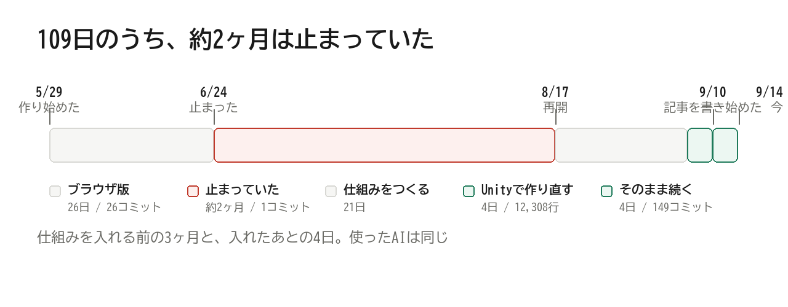
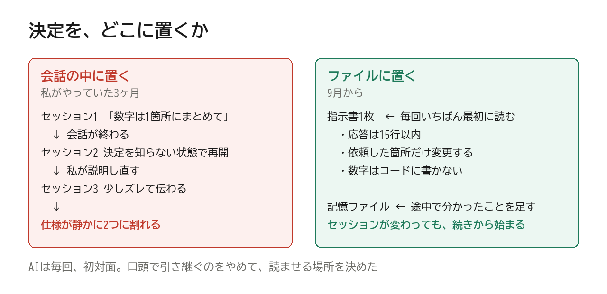
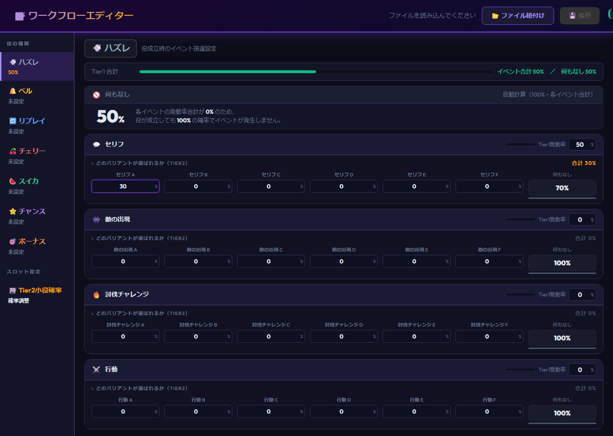
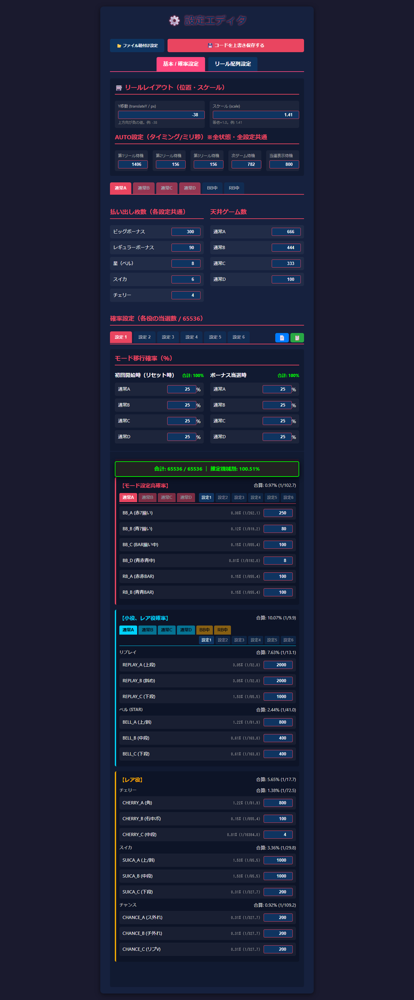
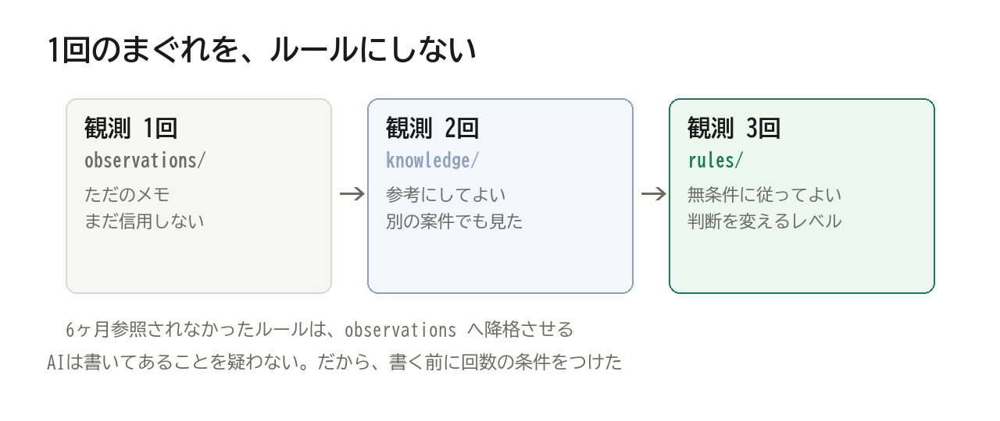
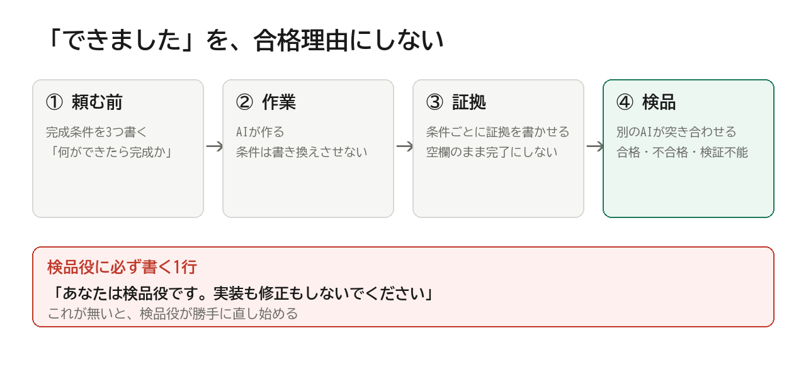
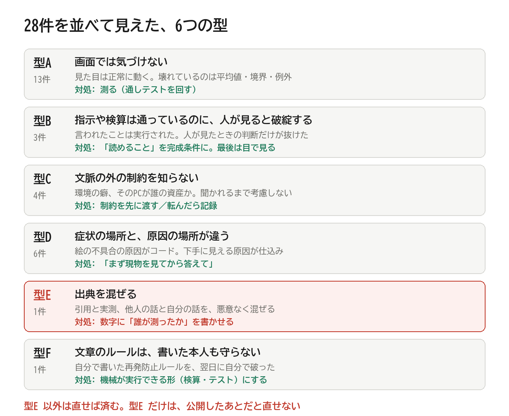
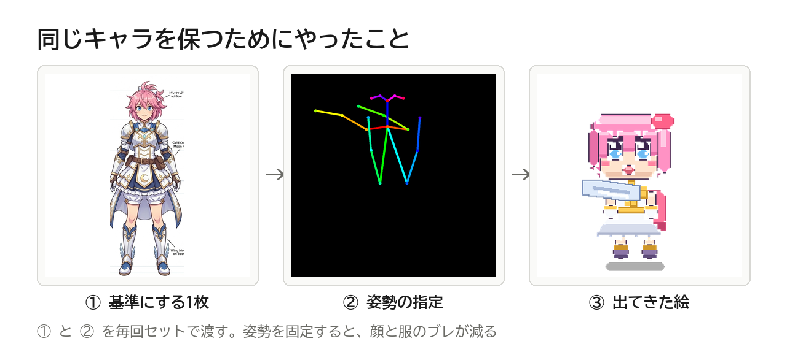
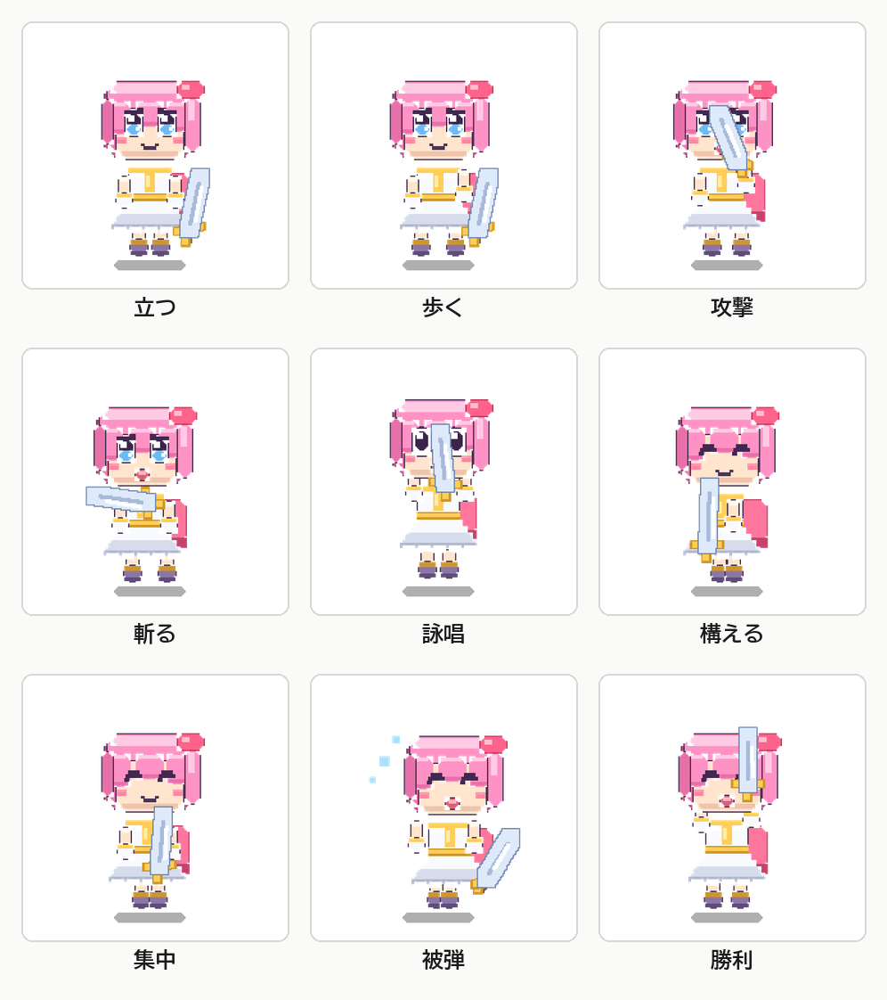
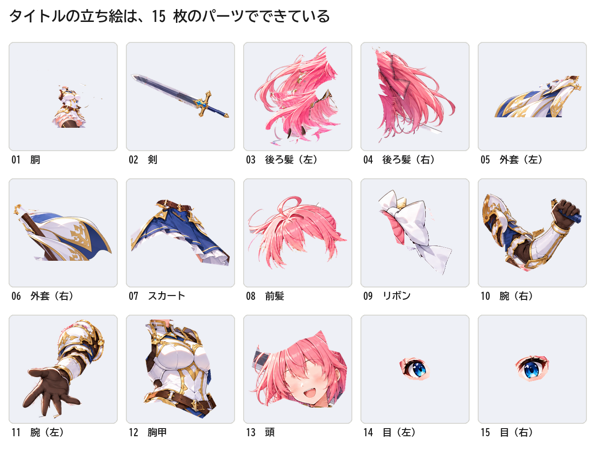

# コードを書けない私が、AIに4ヶ月ゲームを作らせ続けた記録

## ― 12,308行の中身と、壊れた19箇所の全部

<!-- ===================== ここから無料パート ===================== -->

「また同じことを説明してる」

これ、AIにゲームを作らせていた3ヶ月目の、私の口癖です。

月曜に決めたルールを、AIは金曜には忘れている。
「確率はコードに直接書かないで」と言った翌週、また直接書かれている。
直させる。忘れる。直させる。

2026年5月29日に作り始めました。
8月17日の時点でできていたのは、ブラウザで動くスロットの画面が1つだけ。
コミットは26本。うち何本かは、同じ場所の作り直しです。

そして6月24日から8月17日まで、私はこのゲームをほぼ触っていません。
約2ヶ月、止まっていました。

止まる直前のコミットには、こう記録が残っています。

> Please provide the files or the diff so I can generate the commit message for you.

AIが「変更内容を渡してもらえれば、コミットメッセージを作ります」と返してきた文章が、
そのままコミットの履歴になっているんですよね。
私がもう、中身を確認していなかった証拠です。

転機は9月7日でした。
作りかけを全部捨てて、Unity で作り直すと決めた日です。

そこから4日で、12,308行が積み上がりました。

書いたのは私ではありません。AIです。
使っているAIも、5月と同じサービスです。

AI側の更新はこの間にも入っています。
でも、同じ更新を受けながら、私は3ヶ月止まっていました。

動き出したのは、AIに渡す仕組みを変えてからです。

---

## 今、どうなっているのか

- パチスロを土台にしたRPG。リールを回して敵と戦い、章立てのマップを進む
- Unity 6.3 / スクリプト47ファイル / 12,308行
- 敵との戦闘、装備のドロップ、呪いと祝福、AT（ボーナス後の連チャン）、街のショップ、物語
- 主人公の絵は9ポーズ。AIに描かせた
- 効果音は、素材を買わずに合成した
- コミットする前に、毎回100万ゲーム回して壊れないことを確認している


*105日のうち、約2ヶ月は止まっていた。仕組みを入れる前の3ヶ月と、入れたあとの4日*

私はコードを書いていません。
絵も描いていません。

やったのは、決めることだけです。

派手な話ではないです。
「AIに任せたら勝手にできた」でも、ないですね。

むしろ逆で、私が決めることを増やしたら、AIの作業量が一気に増えました。

---

## この記事で、包み隠さず書くこと

書くのは、次の2つです。

ひとつは、AIに作らせ続けるための仕組み。
私が実際に使っている指示書と記憶ファイルの中身を、そのまま載せます。
コピペして使えるテンプレも最後に付けます。

もうひとつは、壊れた箇所の全部。
AIが作ったものが、実際にどう壊れたか。19件を原因の型ごとに分類して並べます。
成功談だけ読んでも、同じところで転ぶだけなので。

うまくいかなかったやり方も書きます。
今も直っていないものも書きます。
そのほうが、たぶん役に立つはずです。

---

## 誰に向けて書いたか

こういう人に向けて書いています。

* コードを書かないけれど、AIに何かを作らせたい人
* ChatGPTやClaudeに頼んで、3日目に会話が破綻した経験がある人
* 個人開発をAIでやろうとして、途中で崩れて止まった人
* AIに「できました」と言われて、後から壊れているのを見つけた人

逆に、こういう人には向きません。先に書いておきます。

* Unityの実装テクニックが知りたい人（この記事にコードの解説はほぼありません）
* 「AIで簡単に稼げる」を探している人（このゲームはまだ1円も稼いでいません）
* すでにチームで開発フローを回しているエンジニア（たぶん全部知っている話です）

3つ目に当てはまる方は、ここで閉じてもらったほうがいいです。

---

## 先に結論を書きます

4ヶ月で分かったのは、たった3つです。

1. **AIに毎回同じことを言わせない**（指示書を1枚に固定する）
2. **AIの記憶を、AIの外に置く**（会話ではなくファイルに残す）
3. **「できました」を信じない**（完成条件を先に書いて、別のAIに検品させる）

これだけです。

高いツールは使っていません。
プロンプトの魔法の言い回しも、使っていないですね。

有料プランのAIと、テキストファイルが数枚。それだけです。

「それ、当たり前じゃない?」と思った方。
私も3ヶ月目まではそう思っていました。
思っていたのに、やっていませんでした。

この3つを"やらなかった3ヶ月"と、"やった4日"の差が、この記事の中身です。

---

## この先に書いてあること

有料パートの目次です。

1. 私の自己紹介（コードも絵も書けない人間が、何をしているのか）
2. 最初の3ヶ月、私は何を間違えていたのか ― "決定の蒸発"という死に方
3. 仕組み① 指示書を1枚に固定する（実物と、効いた3項目・効かなかった書き方）
4. 仕組み② AIの記憶を外に置く（1回目は信用しない、3回目でルールにする）
5. 仕組み③ 「できました」を信じない（完成条件と検品役）
6. **壊れた箇所カタログ19件**（この記事の心臓です）
7. 壊れ方から見えた5つの型と、それぞれの対処
8. 絵と音をどうしたか（AIに同じキャラを描かせ続ける方法）
9. 今も直っていないもの
10. 明日から使える最小セット（テンプレ4種・コピペ可）
11. 私がやって、効かなかったこと

---

## 買う前に、ひとつだけ

この記事には、「これをやれば作れます」という保証は書いていません。

私が知っているのは、私のケース1件だけです。
1件の成功は、再現性の証明にはならないので。

書けるのは、「私はこの仕組みで4ヶ月続いた」という事実と、
「こういう壊れ方を19回した」という記録だけです。

そこに価値を感じたら、続きへどうぞ。

<!-- ===================== ここから有料パート ===================== -->

---

# 1. 私は、コードも絵も書きません

先に自己紹介をしておきます。
「どのくらいの人間の話なのか」が分からないと、参考にしようがないので。

* コードは書けません。読むのは、ぎりぎり少しだけ
* 絵は描けません
* 平日は本業があります。触れるのは、仕事の合間の1日2時間ほど
* ゲーム制作は未経験。Unity は今回が初めて

時間の話も書いておきます。

作り始めたのが5月29日で、今日が9月10日。105日です。
そのうち約2ヶ月は、手が止まっていました（理由は次の章に書きます）。

実際に触っていたのは、50日ほど。
1日あたり2時間くらいです。

まとまった時間は、一度も取れていません。
記録を取っていたわけではないので、この2時間は実感値です。

やっていることは、ひとつだけです。

**私が判断して、AIが作業する。**

この分担を崩す案は、儲かりそうでも採用しない、と決めています。
崩した瞬間に、私の平日が消えるからです。

「それ、AIが優秀なだけなんじゃないの?」

これ、よく言われるんですよね。
でも同じAIで、私は3ヶ月失敗しています。

差がついたのは、AIの外側です。

ただ、仕組みだけが効いた、とも思っていません。
そのときのメモを、そのまま置いておきます。

> **そのときのメモ（2026-09-11）**
> なかなかうまくいかない。
> でも、ちょくちょく AI にアップデートが入るので、最新モデルでやりたいことができるのがいい。

仕組みは、AIが良くなったときに、その分をちゃんと受け取るためのものです。
仕組みが無いと、AIが良くなっても、私の側が受け取れません。

---

# 2. 最初の3ヶ月、私は何を間違えていたのか


*8月17日の時点でできていたもの。ブラウザ版のタイトル画面（2026年6月）*

## "決定の蒸発"

5月29日から8月17日まで、私がやっていたのはこれです。

**全部、会話の中で決めていました。**

「リールは3つで」
「ボーナスはBIGとREGの2種類」
「敵はリプレイのときに出るようにして」

決まる。作られる。動く。ここまでは順調です。

問題は次のセッションでした。

新しい会話を始めると、AIは前回決めたことを何ひとつ知りません。
私が説明し直す。少しズレて伝わる。
AIが前と違う作りにする。私が気づかない。

こうして、仕様が静かに2つに割れていきます。

決定が、会話ログの中にしか存在しない。
会話が終わると、決定も一緒に消える。

私はこの死に方に、"決定の蒸発"という名前をつけました。


*決定を会話に置くか、ファイルに置くか。AIは毎回、初対面になる*

## 具体的に、何が起きたか

一番効いたのはこれです。

私は「確率の数字は、あとで何度も調整する」と分かっていました。
だから「数字は1箇所にまとめて」と何度か言っていました。

でも会話をまたぐたびに、AIは新しい確率をコードの中に直接書きます。

結果どうなったか。

数字をひとつ変えるたびに、私がコードを読んで探す羽目になりました。
コードが読めない私が、です。

「ベルの確率を少し下げたい」という10秒で終わるはずの判断が、
毎回30分の探し物になる。

それが嫌になって、6月24日から8月17日まで、私は止まりました。

## 止まっていた2ヶ月で気づいたこと

止まっている間、私はずっと同じことを考えていました。

「AIが悪いのか、私の使い方が悪いのか」

結論は、後者でした。

AIは毎回、初対面です。
初対面の相手に、前回の決定事項を口頭で伝え続けていた。
それだけの話でした。

人間の新人が毎週入れ替わる職場を想像すると、分かりやすいです。
引き継ぎ書を作らずに口頭で説明していたら、そりゃ崩れます。

だから作ったのが、次の3つです。

---

# 3. 仕組み① 指示書を1枚に固定する

## これは何か

**AIが、毎回いちばん最初に読むテキストファイルを1枚だけ用意します。**

会話を始めるたびに、AIは勝手にこれを読みます。
私は何も言いません。読ませる設定を、最初に1回するだけです。

私が使っているツール（Claude Code）では `CLAUDE.md` という名前のファイルがこれにあたります。
他のツールでも、似た仕組みはだいたいあります。
無いツールでも、「毎回この文章を最初に貼る」で代用できます。

## 何を書くか

私の指示書は、9つの節でできています。

| 節 | 中身 |
|---|---|
| 0 | 短く書く（最優先） |
| 1 | 話し方 |
| 2 | 暴走防止 |
| 3 | 私について |
| 4 | 私の文体（私の代わりに書くとき） |
| 5 | 常に真である事実 |
| 6 | 仮説の投げ方 |
| 7 | 記憶の置き場所 |
| 8 | 仕組みを提案するときのルール |

大事なのは、"性格"ではなく"動作"を書くことです。

「丁寧に作業してください」は効きません。
何をしたら丁寧なのか、AIには分からないので。

## 実際に効いた3項目

私の指示書の中で、体感としてはっきり効いたのはこの3つです。
そのまま抜粋します。

### ① 応答は原則15行以内

```
私は長い応答を読まない。長い応答は、正しくても価値がゼロになる。

1. 応答は原則15行以内。手順とコードは行数に数えない
2. 手順はコードか箇条書きだけで示す。散文で手順を説明しない
3. 背景・理由・設計判断は書かない。私が「なぜ」と聞いたときだけ答える
4. 検証結果は結論だけ。「検証通過」の1行で足りる
5. 同じことを2回書かない
6. 完了報告は3行以内
7. 途中経過を実況しない。終わってから結果だけ言う
```

これを入れる前、私はAIの返答を読んでいませんでした。
長すぎて、読む気にならなかったからです。

読まないと何が起きるか。
AIが「ここは仮の実装です」と書いていても、気づきません。
気づかないまま次に進んで、あとで壊れます。

**読める長さにすることは、品質管理です。**

「15行」という数字自体に根拠はありません。
私が読み切れる長さが、たまたまそこだった、という話です。

### ② 依頼した箇所だけ変更する

```
私が依頼した箇所だけ変更する。
他に気になる点は最後に「指摘」のみ。明示依頼なしには触らない。
私が作ったコンテンツを大きく変える前に、何をどう変えるか先に説明し、確認を取る。
「もっと良くなりそう」は許可ではない。
```

これが無いと、AIは「ついでに」他の場所を直します。

善意なんですよね。
でも私はコードが読めないので、「ついで」の部分が正しいか判断できません。

判断できない変更が混ざると、壊れたときに原因が特定できなくなります。

### ③ 数字はコードに書かない

```
全イベントは確率テーブルで管理する。コードに確率を直書きしない。
新しい抽選を足すときは、必ず対応するテーブルとエディタのタブも作る。
```


*役ごとに、どの演出が何%で出るかを並べた画面。数字はここだけで動く*

これが、3ヶ月目の私を止めた問題への答えです。

今は数字が全部 `game_config.json` という1枚のファイルに入っています。
キーの数は33。
Unity の画面から、12個のタブで直接いじれるようにもしました。

私が「ベルの確率を下げたい」と思ったら、
コードを読まずに、数字ひとつ書き換えるだけで済みます。


*確率を全部この画面に出した。私はコードを読まずに数字を変えられる*

## 効かなかった書き方

逆に、書いても効かなかったものも書いておきます。

* 「慎重に作業してください」 ― 何をしたら慎重なのか定義がない
* 「バグを出さないでください」 ― 出さない方法が書いていない
* 「プロとして振る舞ってください」 ― 出力の長さも中身も変わらなかった
* ルールを最初から100個書く ― AIが全部は守らない。増やすなら効いた順に

**動作で書けないルールは、たぶん効きません。**

「慎重に」ではなく「変更前に影響範囲を列挙して確認を取る」。
これなら、やったかどうかが目で見えます。

## PCが複数あるとき

私はPCを複数使っています。

最初はPCごとに指示書をコピーしていました。
当然のように、内容がズレました。

今は指示書の実体をひとつのフォルダに置いて、
各PCからは1行だけ参照しています。

```
@D:/GitHub/Claude-ExternalBrain/CLAUDE.md
```

これで、1箇所直せば全PCに反映されます。

**PCが1台なら、この節は読み飛ばしてください。**
1台なら意味がありません。

---

# 4. 仕組み② AIの記憶を、AIの外に置く

## 会話は消えるが、ファイルは消えない

指示書は「毎回同じことを言わせない」ための仕組みでした。
でもこれだけでは足りません。

指示書に書けるのは、"最初から分かっていること"だけだからです。

作っている途中で分かることのほうが、実際は多いです。

* この環境では、この書き方をするとファイルが壊れる
* この検証方法は、3回試して3回とも無効だった
* この画面の作り方をすると、文字が背景に埋もれる

こういう発見を、どこに置くか。

会話に置くと、消えます。
指示書に全部書くと、指示書が1000行になって、AIが守らなくなります。

だから、別のファイル群に置きました。

## 入口1枚と、書庫

構造はこうです。

```
BRAIN.md          ← 入口。毎回読む。これだけ小さく保つ（3,000字以内）
├ rules/          ← 昇格済みの判断ルール。迷ったらここ
├ knowledge/      ← 書庫。関係するファイルだけ取りに行く
├ observations/   ← 昇格待ちの発見メモ
├ errors/         ← 効かなかった方法と、効いた方法
├ sessions/       ← セッション要約。前回の続きから始めるため
├ projects/       ← 案件ごとの現在地とタスク
└ checks/         ← 作業種別ごとの合格条件
```

ポイントは、"全部を毎回読ませないこと"です。

毎回読むのは `BRAIN.md` の1枚だけ。
そこに「何がどこにあるか」だけが書いてあります。

AIは今のタスクに関係するものだけ、取りに行きます。

## 1回目は信用しない

ここが、この仕組みでいちばん大事なところです。

新しい発見をしても、いきなりルールにはしません。

| 観測回数 | 置き場所 | 扱い |
|---|---|---|
| 1回 | `observations/` | まだ信用しない。ただのメモ |
| 2回以上（別の案件で） | `knowledge/` | 参考にしてよい |
| 3回以上 | `rules/RULES.md` | 無条件に従ってよい |
| 6ヶ月使われなかった | `observations/` へ降格 | 疑う |

なぜ1回で信用しないか。

**1回のまぐれをルールにすると、AIは間違ったルールを守り続けるからです。**

人間なら「あれ、今回は違うな」と思えます。
AIは書いてあることを疑いません。だから昇格に条件を付けました。


*観測1回はメモ、2回で書庫、3回でルール。1回のまぐれをルールにしない*

## 実例:3回失敗してからルールになったもの

今、私のルールに `R-006` として入っているものがあります。

```
R-006: ファイルの中身をヒアドキュメントで流し込まない

この環境の bash ヒアドキュメントは、長い内容・バックスラッシュ・
引用符・日本語のいずれかが入ると壊れる。壊れ方は3種類:
 (1) 数百行を渡すとコマンドごと失敗する
 (2) 連続バックスラッシュが1個に潰れ、Windowsのパスが別物になる
 (3) 引用符と日本語の組み合わせでエラーになる

よって、ファイルを作る・書き換えるときは専用の書き込み機能を使う。

昇格日: 2026-09-10
根拠: 3案件で3回。
 E-006（2026-09-04 別アプリ、引用符+日本語でエラー）
 E-007（2026-09-07 検証ツール、バックスラッシュが潰れて2度失敗）
 E-006 の再観測（2026-09-02 別リポジトリ、約300行のテキストでエラー）
```

技術的な中身は分からなくて大丈夫です。
見てほしいのは、"構造"のほうです。

* 何が起きたか
* いつ、どの案件で起きたか
* 何回目でルールになったか

ここまで書いてあると、半年後に「このルールまだ要る?」を判断できます。

私の指示書には書いていません。
書いたのはAI自身です。3回転んだあとに。

## 効かなかった記録の書き方

記録を始めた最初のころ、私は「うまくいったこと」だけ書かせていました。

これ、ほぼ役に立ちませんでした。

うまくいったことは、コードを見れば分かります。
分からないのは、"なぜ別のやり方を採らなかったか"のほうです。

なので今は、失敗を先に書かせています。

```
## E-004 画面キャプチャによる検証が3回続けて無効だった

- 効かなかった方法: (1) 対象の窓が他アプリに隠れたまま撮影し、
  別アプリの画面を「対象の色」として読んだ (2) 画面の拡大率が合わず
  座標がずれて、別の場所を撮った (3) 対象自身の一部を「他の窓」と
  誤判定し、検証候補が0件になった
- 効いた方法: 撮影の前に「隠れていないか」「拡大率が合っているか」を確認する
- 次回覚えておくこと: 撮れた画像を疑わずに結論を出さない
```

「効かなかった方法」が先。「効いた方法」が後。
この順番にしてから、同じ提案が戻ってこなくなりました。

## これで何が変わったか

正直に書きます。劇的に何かが変わったわけではありません。

変わったのは、**同じ失敗の3回目が来なくなった**ことです。

1回目は起きます。2回目も起きます。
でも2回目のあとに記録が残るので、3回目の直前でAIが止まるようになりました。

もうひとつ。
新しいセッションが、前回の続きから始まるようになりました。

以前は毎回「今どこまで進んだんだっけ」から始まっていました。
今は `sessions/` の最新の1件を読んで、続きから入ります。

1日2時間ずつしか触れない私には、これが大きかったです。
数日空いても、続きから始まるので。

---

# 5. 仕組み③ 「できました」を信じない

## AIは「完成しました」と言う

これが3つ目です。そして、いちばん軽視されていると思います。

AIは、作業が終わると「完成しました」と言います。
言うだけならタダです。

私はコードが読めないので、その報告を検証できません。
検証できない報告は、報告として機能していません。

## 完成条件を、先に書く

やったことは単純です。

**作業を始める前に、「何ができたら完成か」を書いておく。**

私はこれをタスクのファイルに持たせています。

```json
{
  "id": "T-012",
  "title": "装備のドロップを実装する",
  "acceptance": [
    "敵・狩猟・宝の3箇所から落ちる",
    "鞄が12個で埋まったとき、一番弱いものと自動で入れ替わる",
    "街に戻ったら全部消える",
    "25万ゲーム回して、例外が0件"
  ],
  "evidence": [],
  "status": "todo"
}
```

`acceptance` が完成条件。
`evidence` が証拠。

ここに、3つのルールを付けました。

1. **AIは `acceptance` を書き換えてはいけない**（変えたいなら、理由を出して私の承認を取る）
2. **`evidence` が空のまま `done` にしてはいけない**
3. **AI自身の「完成しました」という発言を、合格理由にしてはいけない**

3つ目が本体です。

## 作った本人には検品させない

もうひとつやっているのが、**検品役を分けること**です。

作業したAIとは別に、検品専用のAIを立てます。
このAIには、実装も修正もさせません。

やらせるのは1つだけ。

「`acceptance` に書いてある条件と、`evidence` に書いてある証拠を突き合わせて、
合格・不合格・検証不能のどれかを返す」

これだけです。

作った本人は、自分の作ったものを甘く見ます。
AIも同じでした。


*頼む前に完成条件、終わったら証拠、最後に別のAIが突き合わせる*

## 私が実際にやっている検証

ゲーム側では、コミットの前に必ず3つ走らせています。

**① 開かずにコンパイル確認**

Unity のエディタを開かずに、コードが通るかだけ確認します。
Unity は起動が重いので、これで待ち時間が消えました。

**② 100万ゲームの通しテスト**

押し方4通り × 25万ゲーム = 100万ゲーム。
実際に遊んだのと同じ処理を回して、毎ゲーム「壊れていないこと」を確認します。

確認しているのは、たとえばこういう条件です。

* 所持金がマイナスにならない
* リールの停止位置が、ルール上ありえない場所にならない
* ボーナスが二重に始まらない
* AT が終わらなくならない

このテストで、後述する「AT が終わらない」バグが見つかりました。

**③ 画面の重なり検算**

文字とアイコンが重なっていないか、計算で確認します。
目で見るより速く、見落としません。

**この3つが通らないものは、コミットしません。**

## 何回まわせば足りるのか

もうひとつ、測るときに学んだことを書いておきます。

20万ゲームで測ったとき、出玉の指標は128.8%〜134.1%の間で揺れました。

同じ設定、同じコードです。
まわした回数が足りないだけで、5ポイント動きます。

200万ゲームにしたら132.6%で落ち着きました。

**測った数字を信じる前に、「何回まわしたか」を見る。**

AIは数字を出しますが、その回数で足りているかは言いません。

## 読者が真似する場合の最小版

ここまで読んで「重い」と思った方へ。

最小版は、これだけです。

**作業を頼む前に、「何ができたら完成か」を3つ書く。**

それだけで、「完成しました」→「これ動いてないよ」の往復が減ります。

私も最初は3つから始めました。
JSONもテストも、後から足したものです。

---

# 6. 壊れた箇所カタログ

ここからが、この記事の心臓です。

AIに作らせたものが、実際にどう壊れたか。
19件、全部書きます。

技術的な詳細は最小限にします。
見てほしいのは「どういう理由で壊れたか」の型です。

## ゲーム側で壊れたもの

### ① リプレイなのに、お金が減っていた

スロットには「リプレイ」という、もう1回タダで回せる役があります。
タダで回せるのが、リプレイの定義です。

実装では、減っていました。

見た目は正常に動きます。リールも回るし、絵柄も揃う。
「無料になっていない」ことだけが間違っている。

"動くけれど間違っている"、の典型です。

### ② 自動プレイが、指示を無視していた

ボーナス中は、正しい順番でボタンを押すと11枚もらえます。
外すと3枚です。

自動プレイの機能が、この指示を見ていませんでした。
つまり自動で回すと、ずっと外し続けます。

11枚もらえるはずが、3枚。

これも画面上は普通に動いています。
もらえる枚数が3分の1になっている。それだけです。

### ③ ボーナスが終わらなくなった

これがいちばん派手でした。

ボーナス中に「特化ゾーン」という強い状態に入る仕組みを作りました。
その強さが強すぎて、ゾーンからゾーンへ連鎖し続けました。

1回のボーナスが、**3,669ゲーム**続きました。
本来は、200ゲーム前後で終わる想定です。

面白いのは、これが**誰も遊ばずに見つかった**ことです。
100万ゲームの通しテストが平均値を出して、桁が違うと分かりました。

人間が遊んで気づくには、何十時間もかかります。

### ④ ボーナス後に、ボタンが押せなくなった

画面を更新する処理の途中でエラーが起きていました。

エラーが起きた場所より後ろの処理が、全部実行されていません。
その「後ろ」に、ボタンを押せる状態に戻す処理が入っていました。

結果、ボーナスが終わったのにボタンが押せない。

エラーメッセージはどこにも出ません。
静かに、後ろ半分だけが実行されていませんでした。

### ⑤ 情報が、背景に埋もれて読めない

背景が動くゲームです。
その上に、情報を表示する半透明の板を置きました。

背景の模様が透けて、文字が読めませんでした。

AIは「半透明の板を置く」という指示を正しく実行しています。
動く背景の上では読めなくなる、という判断だけが抜けていました。

### ⑥ アイコンが、文字に重なった

同じ種類です。

文字を置く位置を決めて、その隣にアイコンを置く。
このとき、アイコンの分の場所を確保していませんでした。

結果、文字とアイコンが同じ場所に重なりました。

### ⑦ マップの端に、絶対に到達できない

ステージが8段あって、段ごとに分かれ道の数が違います。
1本、2本、4本、6本、8本、5本、3本、1本。

上の段の「4番目の道」から、次の段の「4番目の道」へ進む。
そういう作りにしていました。

次の段が3本しかない場合、4番目は存在しません。
そこへ進もうとして、詰まります。

数が違うのに、番号をそのまま使っていた。
それだけの間違いです。

### ⑧ 敵が1種類、一度も出てこない

敵を6種類作りました。

そのうち1種類（スライム）が、通常のプレイでは一度も出ません。
出現を決める抽選表に、その種別が入っていませんでした。

**これは、まだ直っていません。**

### ⑨ ボーナスが成立しているのに、揃えられない

スロットでは、当たりが決まってから絵柄を揃えます。
このとき、リールが少し滑って絵柄を引き寄せます。

滑れる幅を、実機と同じ4コマにしていました。

実測すると、ボーナスが揃う確率は**1ゲームあたり2%**でした。
50回転してやっと1回揃う計算です。

私が「成立してるのに揃えられないんだけど」と言って、初めて測りました。
ルールとしては正しくて、遊べる形になっていなかった、という話です。

滑れる幅を20コマに変えて解決しました。
実機の再現度は落ちますが、こちらを取りました。

### ⑩ 資源を入れたのに、一度も尽きなかった

探索できるゲーム数を「松明」という資源にしました。
1ゲーム進むごとに減って、尽きたら街に戻される。そういう仕組みです。

25万ゲーム回して、一度も尽きませんでした。

減る量より、拾える量のほうが多かったからです。

画面には松明の数が出ていて、増えたり減ったりもしています。
遊びの制限として働いていないことだけが、間違っている。

**資源を入れたら、実際に尽きる頻度を測るまで、実装は終わっていません。**

### ⑪ 2つの状態が、同時に起きていた

ボーナス後の連チャン（AT）と、通常時の敵との戦闘。
この2つは、同時に起きてはいけません。

100万ゲームのうち、558回、同時に起きていました。

割合にすると 0.056% です。
人間が遊んで気づける頻度ではありません。

新しい状態を足したときに、既存の状態との組み合わせを誰も確かめていませんでした。

### ⑫ モンスターが、3体のはずが6体になった

設定ファイルにモンスターを3体書きました。
読み込んだら、6体になっていました。

使っていた読み込みの仕組みが、もともと入っている3体に、
ファイルの3体を足していたからです。上書きではなく、追記でした。

エラーは出ません。ただ倍になるだけです。

### ⑬ 失敗の25%が、腕のせいではなかった

目押しの課題を入れました。狙った位置で止められたら成功、という遊びです。

狙って押しても、成功率は75%でした。

残りの25%は、腕の問題ではありません。
スロットは当たりに応じてリールを滑らせます。その滑りのせいで、狙った位置に止まらない。

遊ぶ側からは、自分が下手なのか台のせいなのか、区別がつきません。

直し方は、課題を出す前に「その位置で押したら成功するか」を先に確かめて、
無理なら課題自体を出さないこと。
狙って押したときの成功率は100%になりました。

**AIは「仕様どおり」に作ります。「理不尽に見えないか」は見ません。**

## AI運用側で壊れたもの

ここからは、ゲームではなく、AIの使い方のほうで壊れた話です。
こちらのほうが、たぶん応用が利きます。

### ⑭ 引用を、私の実測として書かれた

これが**一番危ない失敗**でした。

私のメモの中に、外部の記事から引用した数字が1行ありました。
「ある方法を2週間試して、収益0円だった」という内容です。

AIはこれを、"私自身が実施した検証結果"として、
別の資料に4箇所書きました。

私は何も試していません。

もしそのまま公開していたら、嘘を書いたことになります。

対処として、指示書にこう足しました。

```
リポジトリ内の文章にある数値・実績は、誰が測ったのかを確認するまで
「本人の実測」と書かない。
「〜という検証結果がある」は引用の形。「本人が実測した」とは別物。
```

**AIは、出典を混ぜます。**
これは覚えておいて損がないです。

### ⑮ 長い文章を書かせると、途中で壊れる

私の環境では、ある書き方で長文をファイルに書かせると、内容が壊れました。

壊れ方は3種類あって、うち1つは「記号が1個減る」という静かな壊れ方です。
気づかないまま次に進めます。

3回転んで、ようやくルールになりました（前述の `R-006`）。

**環境の癖は、AIは知りません。**
教えるまで、何度でも同じ書き方をします。

### ⑯ 画面の確認が、3回続けて無効だった

AIに画面のスクリーンショットを撮らせて確認させていました。

3回とも、無効でした。

* 対象の窓が他のアプリに隠れたまま撮影して、別のアプリの色を読んでいた
* 画面の拡大率が合わず、座標がずれて別の場所を撮っていた
* 対象自身の一部を「他の窓」と誤判定して、確認対象が0件になっていた

AIは、撮れた画像を疑いません。
写っているものが正しいと仮定して、そこから結論を出します。

**「証拠を撮る」と「正しい証拠を撮る」は別です。**

### ⑰ 会社のPCで、触ってはいけない設定を使う案を作られた

自動化の仕組みを設計させたときの話です。

AIが出してきた案は、システム設定の変更と、パスワードの保存を前提にしていました。
対象が会社のPCだったので、実装の直前で全部中止しました。

AIは、そのPCが誰の資産か知りません。
聞かれない限り、考慮もしません。

対処として、こう記録しました。

```
自動化を設計する前に、対象マシンが個人資産か会社資産かを先に確認する。
会社PCなら、システム設定・グループポリシー・資格情報の保存を伴う案は
最初から候補に入れない。
```

### ⑱ 原因を、自分が最後に触った場所だと決めつけた

別のアプリで、画面に意図しない色が乗る不具合が出ました。

AIは、自分が直前に実装した部分だけを疑いました。
そこを何度も調べて、直して、「直りました」と報告しました。

症状は残っていました。

最終的に、画面の色を数値で測って、原因が別の層だと分かりました。
AIが実装した部分は、最初から正常でした。

**AIは、自分が直前に触った場所から疑い始めます。**
真犯人が別にいると、いつまでも見つかりません。

### ⑲ 記録は読んだが、実装は読まなかった

これは、私が一番こたえた失敗です。

このゲームには、レベルとソウルとエンバーという3つの伸びしろがあります。
役割は最初から決めてありました。記録にも書いてありました。

ある日、私が「なぜこの区別が分からないのか」と聞きました。

AIは記録どおりに答えました。

でも実際の中身では、レベルは貯まるだけで何にも効いておらず、
エンバーに至っては存在すらしていませんでした。

**AIは、記録を読んで、実装を読んでいませんでした。**

書いてあることと、動いていることは、別です。
記録が整っているほど、この事故は起きやすくなります。

---

# 7. 壊れ方から見えた5つの型

19件を並べて、原因の型に分けるとこうなります。


*19件を原因で分けると5つになった。型Eだけは、公開したあとだと直せない*

## 型A:画面では気づけない

該当:①②③④⑦⑧⑨⑩⑪⑫⑬（11件）

いちばん多い型です。

AIが作ったものは、たいてい画面上は正常に動きます。
壊れているのは、平均値・境界・例外のほうです。

* リプレイでお金が減る（数字が少しずれる）
* ボーナスが3,669ゲーム続く（平均が桁違い）
* 端の道に到達できない（境界だけ）
* 2つの状態が0.056%で同時に起きる（例外だけ）

見た目で気づけないので、**測るしかありません。**

対処:通しテストを回す。人間が遊ぶより、100万回まわしたほうが速く見つかります。

## 型B:指示どおりだが、人が見ると破綻する

該当:⑤⑥（2件）

半透明の板を置け、と言われたので置いた。
文字の隣にアイコンを置け、と言われたので置いた。

どちらも、指示は正しく実行されています。

抜けていたのは「動く背景の上だと読めなくなる」「アイコンにも場所が要る」という判断だけです。

対処:見た目の指示には「どんな状態でも読めること」を完成条件に入れる。

## 型C:文脈の外の制約を知らない

該当:⑮⑯⑰（3件）

* この環境ではこの書き方が壊れる
* このPCは会社の資産である
* この確認方法は、この画面構成では使えない

AIは知りません。聞かれない限り、聞きもしません。

対処:制約は先に渡す。渡し忘れたものは、転んだあとに記録へ足す。
これが仕組み②の存在理由です。

## 型D:調べる場所を間違える

該当:⑱⑲（2件）

ひとつは、自分が直前に触った場所を、原因の第一候補にすること。
真犯人が別の層にいると、いつまでも同じ場所を掘り続けます。

もうひとつは、記録を読んで、実装を読まないこと。
記録が整っているほど、こちらは起きやすくなります。

対処:「まず現物を見てから答えて」と言う。
見た目の不具合なら、先に色や座標を測って、どの層の問題かを決める。

## 型E:出典を混ぜる

該当:⑭（1件）

**これだけは、性質が違います。**

他の4つは、直せば済みます。
これは、公開したあとだと直せません。

引用と実測、他人の話と自分の話、推測と事実。
AIは全部を同じ文章の中で混ぜます。悪意なく混ぜます。

対処:数字と実績には、必ず「誰が測ったか」を書かせる。

私は、AIが書いた文章に数字が出てきたら、
出どころを1回は自分で確認するようにしています。

---

# 8. 絵と音は、どうしたか

コードの話が続いたので、見た目と音の話も書いておきます。

## キャラクターを、同じ顔で9ポーズ描かせる

主人公の絵が要りました。
私は描けません。

AI画像生成を使ったのですが、最初の問題はこれです。

**同じキャラが、毎回違う顔で出てくる。**

対処としてやったのは2つです。

**① ポーズの骨組みを、先に用意する**

「立つ」「歩く」「斬る」「構える」「詠唱する」「集中する」
「被弾する」「勝利する」「攻撃する」の9種類。

それぞれについて、棒人間のような姿勢の指定画像を先に作りました。
AIには「この姿勢で、このキャラを描いて」と渡します。

姿勢が固定されると、顔と服のブレが減りました。

**② 基準になる1枚を必ず一緒に渡す**

最初に気に入った1枚を「基準」として保存して、
以降は毎回それを参照させます。

この2つで、9ポーズ分が使える精度になりました。


*基準の1枚と姿勢の指定を毎回セットで渡す。顔と服のブレが減った*

完璧ではありません。
よく見ると、細部は毎回違います。
ゲーム内で小さく表示されるので、そこは許容しました。


*主人公の9ポーズ。すべてAIが描いた*

## タイトルの立ち絵は、別のAIに作らせた

ゲーム本体は Claude に作らせています。
タイトル画面の立ち絵だけは、ChatGPT に作らせました。

> **そのときのメモ（2026-09-11）**
> GPT で Live2D を作成し、タイトルをリッチにした。

やったことは、1枚の絵を15枚のパーツに切り分けて、重ねて動かすことです。
髪と服が揺れて、呼吸で胸が上下して、まばたきをする。


*タイトルの立ち絵は、15枚のパーツでできている*

頭のパーツは、目を閉じた状態で描かれています。
その上に、開いた目を2枚重ねる。まばたきは、目のパーツを一瞬消すだけです。

見えている絵の裏側は、元の絵には描かれていません。
髪が揺れて隙間ができたときのために、隠れている部分を描き足す必要があります。
その描き足しが13枚。これも AI に描かせました。


*15パーツを重ねた状態。呼吸・目パチ・髪と服の揺れは Unity 側で動く*

正確に言うと、これは Live2D の正式な形式ではありません。
パーツごとに独立して描く、自前の方式です。
ChatGPT 側が書いた説明書に、そのことがはっきり書いてありました。

「Live2D 風」と「Live2D」は別物です。
AI が作ったものの名前は、AI の説明書を読んでから使うようにしています。

道具は1つに決めなくていい、というのがここでの学びです。
私は「何をどのAIに頼むか」を決めただけで、切り分けもコードも書いていません。

## アイコンは、画像を使わずに描いた

ゲームのUI（ボタンやアイコン)は、画像素材を1枚も使っていません。

**コードで図形を描いています。**

理由は3つです。

* 素材を探す時間がゼロになる
* 色やサイズを後からいくらでも変えられる
* ファイルサイズが増えない

「AIに画像を作らせる」より、「AIにコードで図形を描かせる」ほうが、
私の場合は速くて安定しました。

キャラクターのような複雑な絵は無理です。
アイコンや枠のような単純な図形なら、こちらが有利でした。

## 効果音は、合成した

効果音の素材も、買っていません。

必要な音を、その場で作らせています。
ボタンの音、コインの音、敵が出る音。

ただし、あとから本物の素材を置ける作りにしてあります。
指定のフォルダに音のファイルを入れると、そちらが優先されます。

**「今は無いが、あとで差し替えられる」形にしておく。**
これは絵でも音でも同じで、判断を先送りできるので楽でした。

---

# 9. 今も直っていないもの

正直に書きます。
このゲームは完成していません。

現時点で、こういう状態です。

| 件 | 状態 |
|---|---|
| 出玉のバランス | 200万ゲームの実測で132.6%（指示に従った場合）。指示を無視すると107.7%。遊べるが、成立していない |
| 設定差 | 設定2〜5の中身がほぼ同じ。作り直しが要る |
| 敵1種類 | 通常プレイで出てこない（前述の⑧） |
| 第2章以降 | 未作成。クリアすると同じ章を繰り返す |
| ステータス画面 | 街からしか開けない。冒険中にレベルが上がっても振れない |
| グラフ | 保存されない。街に戻ると消える |
| 物語 | 第1章のみ。68行 |

バランス調整は、あえて後回しにしています。

システムを作っている最中に数字を触ると、
翌週には別の場所が変わっていて、また合わなくなるからです。

「システムが揃ってから、まとめて調整する」と決めました。
これが正しいかは、まだ分かりません。

---

# 10. 明日から使える最小セット

ここまでの仕組みを、コピペできる形にしました。

私の環境に合わせた部分は削って、汎用にしてあります。

## テンプレ①:指示書

新しいプロジェクトを始めるとき、いちばん最初に置くファイルです。
`CLAUDE.md` や `.cursorrules` など、ツールに合わせた名前で保存してください。

```markdown
# 作業ルール

## 0. 短く書く（最優先）

1. 応答は原則15行以内。手順とコードは行数に数えない
2. 手順はコードか箇条書きだけで示す。散文で手順を説明しない
3. 背景・理由は書かない。私が「なぜ」と聞いたときだけ答える
4. 検証結果は結論だけ
5. 同じことを2回書かない
6. 完了報告は3行以内（変更したファイル／確認待ち項目）
7. 途中経過を実況しない。終わってから結果だけ言う

## 1. 暴走防止

1. 私が依頼した箇所だけ変更する。他に気になる点は最後に「指摘」のみ
2. 大きく変える前に、何をどう変えるか先に説明し、確認を取る
3. 以下は、そのメッセージ内に明示的な「はい」がない限り実行しない
   - ファイルの削除・既存内容の上書き
   - 外部への送信・投稿・デプロイ
   - 取り返しのつかない操作
4. 完了時は「変えた箇所／触っていない箇所／確認待ち項目」を報告する

## 2. 数値と設定

1. 調整する可能性のある数値は、コードに直接書かない
2. 設定ファイル1枚にまとめ、そこから読む
3. 新しい数値を足すときは、必ず設定ファイル側にも足す

## 3. 事実の扱い

1. 数値・実績を書くときは、誰が測ったのかを確認する
2. 引用と実測を混ぜない。確認できないものは「未確認」と書く
3. 自信がないときは、書く前に「自信がない」と明示する

## 4. 案を出すとき

1. 単一の推薦で終わらせない。構造の違う案を3つ以上、各1行
2. 各案に、似た構造の失敗例を添える
3. 「必ずうまくいく」と書かない
```

そのまま使えます。
合わない項目は消してください。ルールは少ないほど守られます。

## テンプレ②:記憶ファイル

プロジェクトのフォルダに置きます。

```markdown
# NOTES.md — このプロジェクトの記憶

作業を始めるとき、AIは必ずこのファイルを読む。

## 決まっていること

（決定したことを、日付つきで1行ずつ。理由は要らない）

- 2026-XX-XX ○○は△△にする

## 効かなかった方法

（2回以上つまずいた方法だけ書く。1回はまだ書かない）

### 失敗001（日付）何をしようとしたか
- 効かなかった方法:
- 効いた方法:
- 次回覚えておくこと:

## 前回の続き

（セッションの終わりに、AIに書かせる）

- やったこと:
- 完了したこと:
- 途中のもの:
- 次に拾う項目:
```

「前回の続き」だけでも効きます。
セッションの最後に「このファイルの"前回の続き"を更新して」と言うだけです。

## テンプレ③:完成条件

作業を頼むときに、これを一緒に渡します。

```
【依頼】
（やってほしいこと）

【完成条件】
1.
2.
3.

【完成条件を満たした証拠】
（AIがここを埋める。空のまま「完成しました」と言わない）

【触ってはいけない場所】
```

3行でいいです。
「完成条件」を書くだけで、往復が減ります。

## テンプレ④:検品の依頼文

作業したAIとは別のAI（新しい会話でも可）に、これを渡します。

```
あなたは検品役です。実装も修正もしないでください。

以下の【完成条件】と【証拠】を突き合わせて、
「合格 / 不合格 / 検証不能」のどれかで答えてください。

不合格・検証不能の場合は、どの条件のどこが足りないかだけ書いてください。
直し方は書かなくて結構です。

【完成条件】
（貼る）

【証拠】
（貼る）
```

「実装も修正もしないでください」の1行が要ります。
これが無いと、検品役が勝手に直し始めます。

## 最初の1週間の進め方

いきなり全部やらなくていいです。
私は順番を間違えて、3ヶ月無駄にしました。

**1〜2日目:指示書だけ置く**

テンプレ①を置いて、普通に作業させます。
応答が短くなるのを確認してください。

**3〜4日目:完成条件を3つ書く**

テンプレ③を使います。
「完成しました」→「動いてない」の往復が減るのを確認してください。

**5〜7日目:記憶ファイルを作る**

テンプレ②を置いて、セッションの最後に更新させます。
翌日、続きから始まるのを確認してください。

検品役は、この3つが回ってからで十分です。

---

# 11. 私がやって、効かなかったこと

最後に、採用しなかった方法を書いておきます。
たぶんここがいちばん時間を節約できます。

## 会話の中で全部決める

3ヶ月やって、失敗しました。
決定が会話と一緒に消えます。前述のとおりです。

## プロンプトを長くする

指示を長く、細かく書けば精度が上がると思っていました。

上がりませんでした。
長い指示は、後半が守られません。

効いたのは、長さではなく、"動作で書くこと"でした。

## ルールを最初から100個書く

一度、思いつくルールを全部書いたことがあります。

AIは守りませんでした。
守られたのは、上のほうの数個だけです。

今は、実際に転んでからルールを足しています。
転んでいないルールは、たぶん要らないです。

## AIに全部お任せする

「いい感じにやっといて」は、いちばん高くつきました。

出てきたものが良いか悪いか、私に判断できません。
判断できないものは、後で全部やり直しになります。

**判断だけは、私がやるしかない。**
これが4ヶ月でいちばん確信していることです。

## 毎回チューニングする

数字を触るたびに、他の場所が合わなくなります。
1日2時間ずつしか触れない私は、これで何週も溶かしました。

今は「システムが揃うまで、数字のズレは報告だけ。調整しない」と決めています。

---

# 締め

5月29日に作り始めて、8月17日に止まりました。
その2ヶ月の空白に残っていたのは、
AIが返した「変更内容を渡してもらえれば、コミットメッセージを作ります」という一文だけです。

私が中身を見ていなかった証拠です。

9月7日、作りかけを全部捨てました。
捨てた日から4日で、12,308行が積み上がりました。

やったのは3つだけです。

1. AIに毎回同じことを言わせない（指示書を1枚に固定する）
2. AIの記憶を、AIの外に置く（会話ではなくファイルに残す）
3. 「できました」を信じない（完成条件を先に書いて、別のAIに検品させる）

高いツールは要りません。
テキストファイルが数枚あれば足ります。

まとまった時間も要りませんでした。
私が使えたのは、仕事の合間の1日2時間です。

このゲームは、まだ完成していません。
出玉のバランスは壊れているし、第2章は影も形もありません。
まだ1円も稼いでいません。

だからこれは、成功談ではないです。
「4ヶ月止まらずに続いた」という、それだけの記録です。

ちなみに、このゲームのテーマは
**「引き返すことは、負けなのか」**にしました。

プレイヤーは頻繁に引き返します。
1つ前の段に戻って、また登り直す。

私も8月に、3ヶ月分を捨てて引き返しました。
そこから4日で、それまでの3ヶ月を超えました。

戻ったぶんは、たぶん無駄ではなかったんだと思います。

明日からじゃなく、今日。
まずはテンプレ①を、1枚置くところからで十分です。

---

## 付録:この記事に出てくる数字の出どころ

書いた数字は、全部プロジェクトの記録から取っています。
どこから取ったかを書いておきます。

| 数字 | 出どころ |
|---|---|
| 制作開始 2026-05-29 / 現在 2026-09-10 | Gitのコミット履歴 |
| ブラウザ版 26コミット / 約2ヶ月の空白 | 同上 |
| 12,308行 / 47ファイル | Unityプロジェクトのスクリプト実測 |
| 100万ゲームの通しテスト | 押し方4通り × 25万ゲーム |
| ボーナス3,669ゲーム | 通しテストの実測値（修正済み） |
| ボーナスが揃う確率 2%/ゲーム | 通しテストの実測値（修正済み） |
| 設定ファイル33キー / エディタ12タブ | 実ファイル |
| 敵6種 / ステージ30 / 物語68行 | 実データ |
| 失敗の記録19件 | プロジェクトの失敗記録ファイルと制作ログ |
| 出玉の指標 132.6% / 107.7% | 設定1・200万ゲームの実測（2026-09-09） |
| 20万ゲームでの揺れ 128.8〜134.1% | 同上。回数が足りないときの振れ幅 |

| 実作業 平日1日2時間ほど | 本人の実感値。時間の記録は取っていない |
| 実際に触っていた期間 約50日 | 105日のうち、6/24〜8/17 の約2ヶ月は止まっていたため |

費用は測っていません。次に作るときは測ります。
